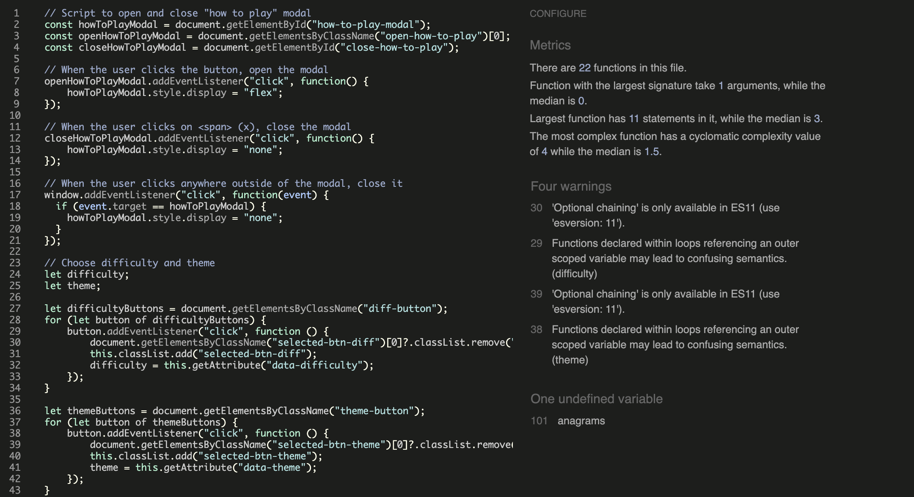

# Anagram Master

Anagram Master is an online game designed to challenge and entertain word game enthusiasts. In this game, players are tasked with unraveling the mystery hidden within an anagram.

To enhance the gaming experience players can choose their preferred topic and challenge themselves selecting the level of difficulty.

[View the live site here](https://fsjavier.github.io/anagram-master/)

## Table of Contents

* [User Goals](#user-goals)
* [Features](#features)
* [Design](#design)
* [Technologies Used](#technologies-used)
* [Testing](#testing)
* [Deployment](#deployment)
* [Credits](#credits)

## User Goals

* As a user, I want to:
  1. Know how to play.
  2. Select a level of difficulty.
  3. Select a theme for the anagrams.
  4. Receive help if I can't find the word.
  5. Track my score.
  6. Be able to end the game / start over.
  7. Save my highest score to try to improve it next time.

## Features

The website has been developed in one html file containing 3 main interactive sections, the user will see one of them at a time as they advance through the game: start, game and game over.

### Start screen

The screens consists of:
* Header with game name and logo.
* How to play button.
    * When clicked a modal is displayed with information about how to play.
    * The modal can be closed clicking on the "X" or anywhere outside the modal.
* Select Difficulty: the user can select either "normal" or "hard".
* Select Theme: the user can select the theme of the game. Only 1 of the 4 options can be chosen.
* Hovering over a button and selecting a theme and difficulty highlights the button.
* The "Let's go!" starts the game. If the user has not selected difficulty and/or theme they will be warned with a message above the button and it won't work until they do.

Start Screen

### Game screen

The screens consists of:
* A background image matching the theme selected by the user.
* Header with game name and logo.
* Time remaining for each anagram.
    * The time will be different depending on the difficulty level chosen.
    * The last 5 seconds the counter will turn red to alert users visually.
* Restart button: Returns to "Start screen" and the game progress will be lost.
* The theme chosen is displayed as a reminder.
* The current anagram to solve. The anagrams will be displayed randomly to avoid showing always the same in the same order.
* An input field where the user must type their answer.
* A hint button:
    * It will display a modal with a hint that will help the user solve the anagram.
    * The modal can be closed clicking on the "X" or anywhere outside the modal.
    * Clicking on a hint will subtract points from the user's score (only the first time each round). The number of points will be different depending on the difficulty level.
* The check answer button checks if it's correct or incorrect:
    * To avoid being clicked by mistake, it will only work if the field is not empty.
    * If the user presses the "Enter" button it will have the same effect as clicking on "Check answer".
    * If the answer is correct the answer field will turn green and it will add points to the user's score and move on to the next round.
    * If the answer is incorrect the answer field will turn red and will move to the next round without adding any points. Not showing the correct answer is a deliberate decission to keep the game challenging it the user wants to play again.
* The round number: The game consists of 8 rounds and the current round is displayed.
* The current score.
* If the user runs out of time the answer will be checked.
* After all rounds have been completed the game moves to the next screen.

Game Screen (Animals Theme)

Game Screen (Movies Theme)

Game Screen (Music Theme)

Game Screen (Countries Theme)

### Game Over screen

The screens consists of:
* Text indicating the game is over.
* The user's final score.
* The user's highest score:
    * The user's highest score is saved on local storage.
    * If the current score is higher than the previous saved highest score, the highest score is updated.
* "Play Again!" button sends the user back to the "Start screen".

Game Over Screen

### 404 page

* A custom 404 page will be displayed if the users tries to navigate to a page that can't be loaded.
* It maintains the look and feel of the website and provides users with the ability to navigate back through links.

404 page

### Favicon

* A site wide favicon provides an image with the look of the website in the tabs header, allowing users to easily find it among several open tabs.

Favicon

### Features left to implement

* Add more anagramas for each theme and more themes.
* The current system to answer anagrams is not ideal for mobile. The keyboard is displayed on the screen and covers important game information. A better solution should be achieved. An option being considered is dragging and dropping letters instead of writing.
* Add highest score for each theme instead of just one global highest score.
* Replace the highest score saved on local storage for scores being saved in a database, so that different users can compete with each other.

## Design

### Wireframes

Start Screen

Start Screen - How to Play Modal

Game Screen

Game Screen - Hint Modal

Game Over Screen

## Technologies Used

### Languages

* HTML
* CSS
* JavaScript

### Frameworks and tools

* [Codeanywhere](https://codeanywhere.com) was the IDE used to develop the website.
* Git was used for version control.
* [GitHub](https://github.com) is used to host the code and deploy the website.
* [Balsamiq](https://balsamiq.com/wireframes) was used to create the wireframes.
* [Google Fonts](https://fonts.google.com) was used to import the Montserrat and Poiret One fonts.
* [Font Awesome](https://fontawesome.com) was used to import the icons.
* [TinyPNG](https://tinypng.com) was used to compress the images.
* [Favicon](https://favicon.io/) to create the favicon files and links.
* [AutoDraw](https://www.autodraw.com/) to create the favicon logo.

## Testing

### Validator Testing

#### HTML

The site passed without errors or warnings through the W3C Markup Validation Service.

HTML test

#### CSS

No errors were found through the W3C Jigsaw CSS Validation Service.

CSS test

#### JavaScript

JSHint quality tool has been used to test the code, without finding any significant issues.

JSHint test

### Accessibility
 
#### Lighthouse

Lighthouse from Google Chrome Developer Tools was used to test performance and accessibility.

Lighthouse Test - Desktop

Lighthouse Test - Mobile

  
#### Wave WebAIM

The WAVE WebAIM web accessibility tool was used during the development of the website. It has warned me of low contrast between text and some of the background themes, what led me to change their styles.

In the final testing of the website to check there were no accessibility problems.

### Manual Testing

#### User goals fulfillment

| Goal | Feature | Steps | Expected Outcome | Outcome |
|------|---------|-------|------------------|---------|
| Know how to play. | "How to play" button. | Click on the "How to play" button. | A modal with the information will be displayed, which can be dismissed clicking on the "X" or anywhere outside the box. | Works as expected. |
| Select a level of difficulty. | Select difficulty. | Click on the "Select difficulty" buttons. | Selecting a button will highlight it to show the user the difficulty chosen.  Selecting a button deselects the previously selected difficulty button. | Works as expected. |
| Select a theme to play. | Select theme. | Click on the "Select theme" buttons. | Selecting a button will highlight it to show the user the theme chosen.  Selecting a button deselects the previously selected theme button. | Works as expected. |
| Receive help if I can't find the word. | "Hint" button. | 1. Select a difficulty level and theme and click "Let's go" to start the game.  2. When the anagram is presented click on "Hint". | Clicking on "Hint" shows a modal with information that will help the user solve the anagram.  The hint can be shown as many times as the user wants, but only first time the hint is displayed points will be subtracted.<br The modal can be dismissed clicking on the "X" or anywhere outside the box. | Works as expected. |
| Track my score. | Score area. | 1. Select a difficulty level and theme and click "Let's go" to start the game.  2. The score is displayed in the bottom right side of the game screen.  3. After finishing all rounds the final score will be shown. | A correct answer will add 3 points to the user's score.   Asking for a hint will subtract 1 point or 2 points, depending on the difficulty level, from the user's score. | Works as expected. |
| Be able to end the game / Start over. | "Restart" button.  "Play again!" button". | 1. Select a difficulty level and theme and click "Let's go" to start the game.  Option 1: Click on "Restart" button in the top right side of the game screen.  Option 2: After finishing all rounds the final screen will be shown, click on "Play again!". | Clicking either on "Restart" or "Play again" reloads the page and the user can select their preferences again. | Works as expected. |
| Save my highest score to try to improve it next time. | Highest score saved on local storage. | 1. Select a difficulty level and theme and click "Let's go" to start the game.  2. Play all rounds.  3. After finishing all rounds both the final score and the user highest score will be shown. | The first time a user play their score will be saved as their highest score and it will be shown in the final screen.  Everytime the user beats their previously saved highest score, the current score will be saved as the new highest score. | Works as expected. |

#### Functional testing

* Start screen

| Situation | Expected Outcome | Outcome |
|-----------|------------------|---------|
| A user clicks on "How to play". | The "How to play modal is shown". | Works as expected. |
| A user wants to close the "How to play" modal. | Clicking on the "X" or anywhere outside the box closes the modal. | Works as expected. |
| A user clicks on "Let's go" without selecting difficulty level and theme. | A warning message above the "Let's go" button will be displayed and the game won't start. | Works as expected. |
| A user hovers over any of the buttons. | The button is highlighted. | Works as expected. |
| A user clicks on one of the difficulty level buttons. | The button is highlighted. | Works as expected. |
| A user clicks on one of the difficulty level buttons, when the other had been previously selected. | The button clicked is highlighted and the previously selected button is deselected. | Works as expected. |
| A user clicks on one of the theme buttons. | The button is highlighted. | Works as expected. |
| A user clicks on one of the theme buttons, when one of the other had been previously selected. | The button clicked is highlighted and the previously selected button is deselected. | Works as expected. |
| A user clicks on "Let's go" selecting difficulty level but not theme. | A warning message above the "Let's go" button will be displayed and the game won't start. | Works as expected. |
| A user clicks on "Let's go" selecting theme but not difficulty level. | A warning message above the "Let's go" button will be displayed and the game won't start. | Works as expected. |
| A user clicks on "Let's go" selecting difficulty level and theme. | The "Start screen" will be hidden and the "Game Screen" will be displayed. | Works as expected. |

* Game screen

| Situation | Expected Outcome | Outcome |
|-----------|------------------|---------|
| A user selects "Normal" difficulty and a theme. | The game screen is displayed and:  1. The background for the selected theme is displayed.  2. The name of theme is displayed above the anagram.  3. The round will be set to "1 of 8".  4. The timer with 45 seconds starts.  5. The first randomly selected anagram to solve is displayed and the input field is selected. | Works as expected. |
| A user selects "Hard" difficulty and a theme. | The game screen is displayed and:  1. The background for the selected theme is displayed.  2. The name of theme is displayed above the anagram.  3. The round will be set to "1 of 8".  4. The timer with 30 seconds starts.  5. The first randomly selected anagram to solve is displayed and the input field is selected. | Works as expected. |
| A user hovers over any of the buttons. | The button is highlighted. | Works as expected. |
| A user clicks on "Check Answer" or presses "Enter" with an empty input field. | Nothing happens. | Works as expected. |
| A user clicks on "Check Answer" or presses "Enter" after writing a wrong answer in the input field. | The input field turns red, no points are added to the score and after 2 seconds moves to the next round. | Works as expected. |
| A user clicks on "Check Answer" or presses "Enter" after writing the correct answer in the input field. | The input field turns green, 3 points are added to the score and after 2 seconds moves to the next round. | Works as expected. |
| A user enters the last 5 seconds of the round. | The countdown timer turns red during the last 5 seconds. When the user moves to the next round the timer is white again. | Works as expected. |
| The time for the round is over. | The input field is checked and the same procedure for incorrect/correct answer described above applies. | Works as expected. |
| A user clicks on "Hint" for the first time in a round. | The modal with helpful information to solve the anagram is displayed and 1 or 2 points will be subtracted from the user's score, depending the current difficulty level. | Works as expected. |
| A user clicks on "Hint" again after the first time in a round. | The modal with helpful information to solve the anagram is displayed and no points are subtracted. | Works as expected. |
| Either the user checks an answer or runs out of time in a round. | The next round loads and:  1. A new anagram is displayed  2. The timer starts again with either 45 seconds or 30, depending on the difficulty level.  3. The text with "Round X of 8" is updated with the current round". |
| A user clicks on "Restart" | The page is reloaded, which resets the game information and the user returns to the the "Start screen". | Works as expected. |
| A user completes the 8 rounds. | The "Game screen" will be hidden and the "Final screen" is displayed.

* Game Over screen

| Situation | Expected Outcome | Outcome |
|-----------|------------------|---------|
| A user finish the game for the first time. | The score and the highest score will be displayed. The highest score will be equal to the current score. | Works as expected. |
| A user finish the game after the first time with a lower score than their current highest score. | The current score and the previously achieved highest score will be displayed. | Works as expected. |
| A user finish the game after the first time with a higher score than their current highest score. | The current score is displayed and the the highest score is updated with the current score. | Works as expected. |
| A user clicks on "Play Again!". | The page is reloaded, what resets the game information (except the highest score) and the user returns to the the "Start screen". | Works as expected. |

#### Responsiveness

All pages have been tested for responsiveness with Google Chrome Developer Tools on screens from 320px, making sure the content adjusts correctly on all screen sizes.

On physical device, it has been tested on iPhone 13 in vertical and horizontal orientation.

#### Browsers compatibility

The website has been tested in the following browsers on desktop, without finding any issues:

* Chrome
* Safari
* Firefox
* Opera
* Edge

### Bugs

| Bug | Solution |
|-----|----------|
| On mobile horizontal orientation the top and bottom content were cut off on Start screen. | Replace height property with min-height. |
| On mobile horizontal orientation the game container was too small and there was not enough space for the text. | Increase game container size. |
| The buttons with links resulted in style not being applied properly because it was not valid HTML5  | Remove the button element and apply the button class to a different element. |
| After clicking on the "Hint" button the focus from the input field was gone. | Add focus again to the function that closes the modal. |
| Clicking repeatedly on "Hint" in a round would subtract points each time from the score. | Add a boolean variable that tracks if the user has already clicked on "Hint" in the current round. |
| After the user answered the countdown timer continues running for a couple of seconds. | Move clearInterval() function from setNextQuestion() to checkAnswer(). |
| After the last round the game moved too fast to the final screen, without having time even to see if the answer was correct or incorrect. | Add the same setTimeOut() function that is place for the rounds where the game continues after answer. |

## Deployment

### Deployment to GitHub Pages

The site was deployed to GitHub pages. The steps to deploy are as follows:

* In the GitHub repository, navigate to the Settings tab.
* From the menu on left select 'Pages'.
* From the source section drop-down menu, select the Branch: main.
* Click 'Save'.
* A live link will be displayed in a green banner when published successfully.

The live link can be found here - https://fsjavier.github.io/anagram-master/

### How to clone the repository

* Go to https://github.com/fsjavier/anagram-master
* Click on the code drop down button, then click on HTTPS and copy the link to the clipboard.
* Open a GitBash terminal and navigate to the directory where you want to locate the clone.
* Type git clone copied-git-url and press the Enter key.

The project will now of been cloned on your local machine for use.

## Credits

### Content

Inspiration to create the anagrams from https://www.wordplays.com/anagrammer

### Code

* Inspiration for the game design from the Love Maths CI Walkthrough project and ["How to make a Quiz App" tutorial from Brian Design](https://www.youtube.com/watch?v=f4fB9Xg2JEY).
* [How to create a countdown timer](https://www.freecodecamp.org/news/how-to-create-a-countdown-timer/) from freeCodeCamp.
* [How to save data on local storage](https://www.w3schools.com/jsref/prop_win_localstorage.asp) from W3schools.
* [How to make a modal](https://www.w3schools.com/howto/howto_css_modals.asp) from W3schools.
* [How to keep active CSS after click on button](https://www.youtube.com/watch?v=zh1xus05Kl8) from ByteGrad Tips.

### Media

* bg-main: Image by [Pete Linforth](https://pixabay.com/users/thedigitalartist-202249/) from [Pixabay](https://pixabay.com/)
* bg-animals: Image by [Chakkree Chantakad](https://pixabay.com/users/chakkree_chantakad-15107399/) from [Pixabay](https://pixabay.com/)
* bg-movies: Image by [Gerd Altmann](https://pixabay.com/users/geralt-9301/) from [Pixabay](https://pixabay.com/)
* bg-movies: Image by [Gerd Altmann](https://pixabay.com/users/geralt-9301/) from [Pixabay](https://pixabay.com/)
* bg-countries: Image by [Venita Oberholster](https://pixabay.com/users/artsybeekids-392631/) from [Pixabay](https://pixabay.com/)
* bg-404: Image by [Chen](https://pixabay.com/users/chenspec-7784448/) from [Pixabay](https://pixabay.com/)

### Acknowledgments

Thank you to my mentor Gareth McGirr for his guidance, feedback and resources provided.